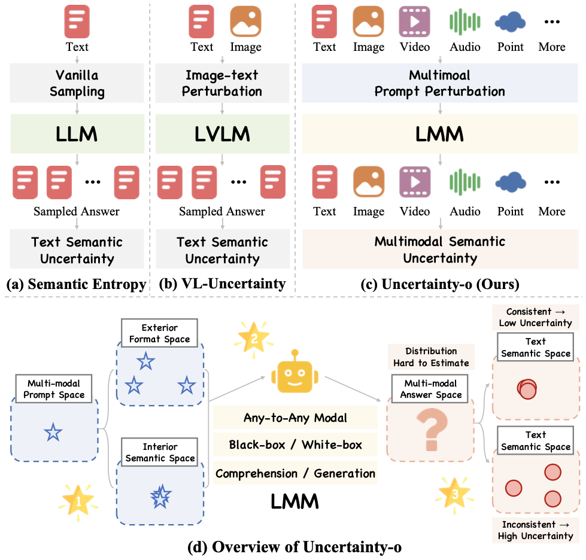
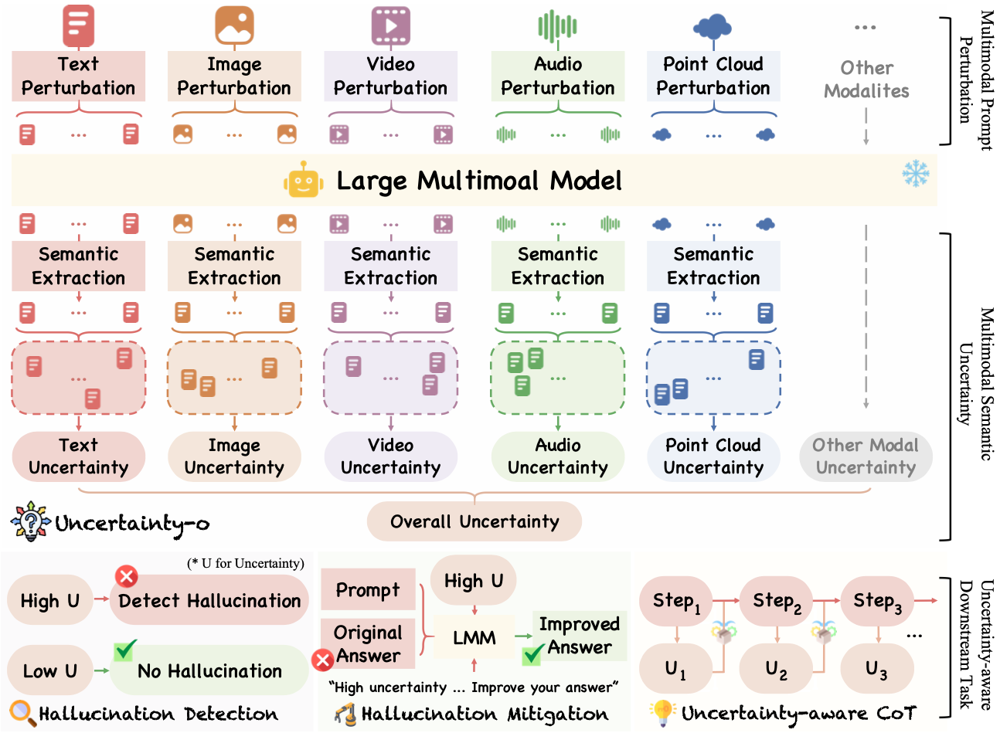
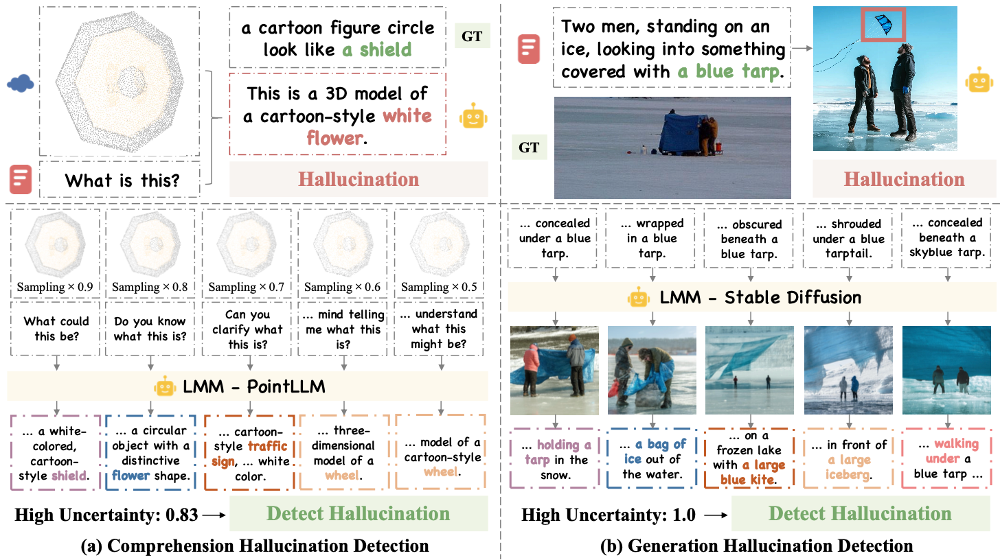

<p align="center">
     <br>
</p>

# 🔎 Uncertainty-o

[Ruiyang Zhang](https://ruiyang-061x.github.io/), [Hu Zhang](https://huzhangcs.github.io/), [Hao Fei](https://haofei.vip/), [Zehdong Zheng*](https://www.zdzheng.xyz/)

**[Website](https://Uncertainty-o.github.io/)** | **[Paper]()** | **[Code](https://github.com/Ruiyang-061X/Uncertainty-o)**


## ⚡ Overview

<p align="center">
     <br>
</p>

## 🔥 News

- 2025.3.11: 🐣 Source code of [Uncertainty-o](https://github.com/Ruiyang-061X/Uncertainty-o) is released!

## 📋 Contents
- [✏️ Method](#%EF%B8%8F-method)
- [🛠️ Install](#%EF%B8%8F-install)
- [💻 Dependency](#-dependency)
- [📚 Data Preparation](#-data-preparation)
- [📈 Run](#-run)
- [🏄 Examples](#-examples)
- [⌨️ Code Structure](#%EF%B8%8F-code-structure)
- [✨ Acknowledgement](#-acknowledgement)
- [📎 Citation](#-citation)

## ✏️ Method

<p align="center">
     <br>
</p>

**Pipeline of Our Uncertainty-o.** Given a multimodal prompt and large multimodal models, we perform multimodal prompt perturbation to generate diverse responses. Due to the inherent epistemic uncertainty of these models under perturbation, varied responses are typically obtained. To quantify this uncertainty, we apply semantic clustering on the collected responses and compute their entropy. Specifically, responses are grouped into semantically similar clusters, and the entropy across these clusters is calculated as the final uncertainty measure. Higher entropy indicates greater variability in responses, suggesting lower confidence, while lower entropy reflects higher consistency and thus higher confidence.

## 🛠️ Install

- Create conda environment.

```
conda create -n Uncertainty-o python=3.11;

conda activate Uncertainty-o;
```

- Install dependency.

```
pip install torch torchvision torchaudio --index-url https://download.pytorch.org/whl/cu121;

pip install transformers datasets flash-attn accelerate timm numpy sentencepiece protobuf qwen_vl_utils;
```

(Tested on NVIDIA H100, NVIDIA A100)

## 💻 Dependency

Refer to [Dependency.md](doc/Dependency.md).


## 📚 Data Preparation

Refer to [Data.md](doc/Data.md).

## 📈 Run

- For Comprehension Hallucination Detection, Hallucination Detection for Closed-Source LMMs, Hallucination Detection for Safety-Critic Tasks

```
bash run/comprehension_hallucination_detection.sh;
```

- For Generation Hallucination Detection

```
bash run/generation_hallucination_detection.sh;
```

- For Hallucination Mitigation

```
bash run/hallucination_mitigation.sh;
```

- For Uncertainty-Aware Chain-of-Thought

```
bash run/uncertainty_aware_cot.sh;
```

## 🏄 Examples

- Uncertainty-o successfully detects both comprehension and generation hallucination:

<p align="center">
     <br>
</p>

## ⌨️ Code Structure

- Code strucuture of this repostory is as follow:

```
├── Uncertainty-o/ 
│   ├── .asset/
│   ├── args/                       # Args parser
│   ├── benchmark/
│   │   ├── comprehension/          # Benchmark for comprehension task
│   │   ├── generation/             # Benchmark for generation task
│   ├── dependency/                 # Downstream source code for LMMs
│   ├── factory/                    # Builder for benchmarks, models
│   ├── llm/
│   │   ├── Qwen.py                 # LLM class
│   ├── metric/                     # Metric for hallucination detection
│   ├── mllm/
│   │   ├── comprehension/          # LMM for comprehension task
│   │   ├── generation/             # LMM for generation task
│   ├── perturbation/               # Multimodal prompt perturbation
│   ├── run/                        # Experiment scripts
│   ├── uncertainty/                # Multimodal semantic uncertainty
│   ├── util/
│   ├── .gitignore
│   ├── hallucination_detection.py  
│   ├── hallucination_mitigation.py 
│   ├── README.md
│   ├── uncertainty_aware_cot.py    
```

## ✨ Acknowledgement

- [AnyGPT](https://github.com/OpenMOSS/AnyGPT), [OneLLM](https://github.com/csuhan/OneLLM), [InternVL](https://github.com/OpenGVLab/InternVL), [PointLLM](https://github.com/OpenRobotLab/PointLLM): Thanks a lot for those foundamental efforts!
- [semantic_uncertainty](https://github.com/jlko/semantic_uncertainty): We are inspired a lot by this work!
- [VL-Uncertainty](https://github.com/Ruiyang-061X/VL-Uncertainty): We build our codebase based on this work!


## 📎 Citation

If you find our work useful for your research and application, please cite using this BibTeX:

```bibtex
@article{zhang2025uncertainty,
  title={Uncertainty-o: One Model-agnostic Framework for Unveiling Epistemic Uncertainty in Large Multimodal Models},
  author={Zhang, Ruiyang and Zhang, Hu and Hao Fei, and Zheng, Zhedong},
  year={2025}
}
```
